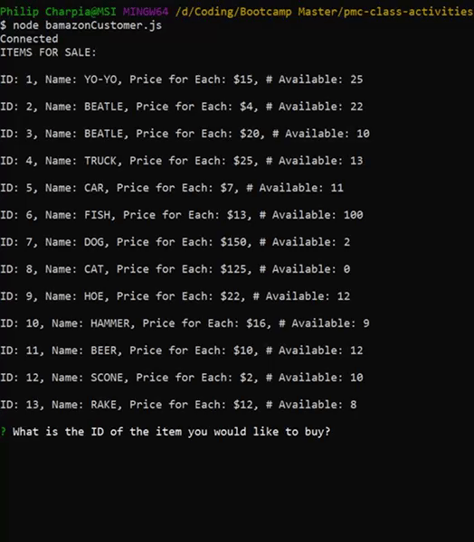
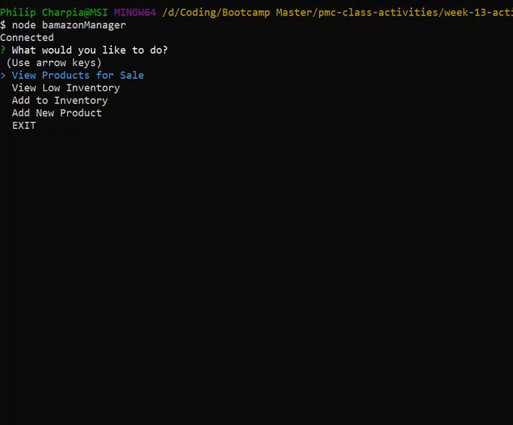

# bamazon

##App Overview

bamazon is a sales tracking app which uses an SQL database to house information about products for sale.
This is a CLI app run with Node.js.

This app was created as a homework assignment for the UNCH Coding Bootcamp in week 13 of the program. The assignment focuses on the use of mySQL.

###Technologies Used

1. Node.js

2. Inquirer.js

3. mySQL.js

4. mySQL Workbench

###Setup

1. Clone the repo from GitHub.

2. In the command prompt navigate to the root folder and run `npm install` 
to obtain all of the necessary node modules listed in the `package.json`.

3. Using mySQL Workbench - create a database named `bamazon`.

4. Add a table to this database with columns as follows: `item_id` INT NOT NULL AUTO_INCREMENT, `product_name`: VARCHAR(45) NOT NULL, `department_name`: VARCHAR(30), `price`: INT NOT NULL, and `stock_quantity`. The primary key will be item_id.

5. Fill in this table with a few items.

###Use

#####Customer

1. Use the command prompt navigated to the root folder to run `node bamazonCustomer.js`.

2. The initial screen readout provides all products available.

3. Follow the app guidance to purchase items available in the store.

#####Manager

1. Use the command prompt navigated to the root folder to run `node bamazonManager.js`.

2. This app utilizes node Inquirer to request user input. Initial user input 
directs the program to run one of four functions.

3. The manager may view products for sale, view low inventory products, add stock to any item already in the store, and/or add a new product.